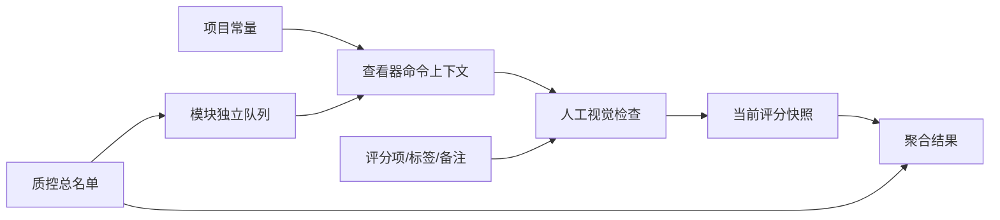

# EasyQC 项目概览

## 1. EasyQC 解决什么问题

医学影像人工视觉质控通常横跨四个彼此分离的动作：找到待检查数据、在专业查看器中打开它、记录人工判断、把不同任务与质控员的结果合并。若只依赖文件浏览器、命令行、电子表格和零散备注，最容易出现的问题并不是“看不见图像”，而是上下文断裂：当前看的记录与保存的评分不一致、任务定义随人变化、名单筛选不可追溯、结果表难以重建。

EasyQC 把这些动作组织为本地项目：

它不重写图像渲染器，而是把已有专业工具纳入结构化、可追踪的工作流。

## 2. 产品定位

更准确的定位不是“一个 MRI 查看器”，而是：

> 面向人工视觉质控的、离线的、可配置工作流编排与记录工作台。

这一定义包含四个边界：

1. **人工判断**：分数、标签和备注由质控员给出。
2. **外部显示**：EasyQC 调用专业查看器，不实现 NIfTI/DICOM 渲染。
3. **项目化记录**：名单、常量、模块、评分和结果具有明确身份和文件归属。
4. **本地可配置**：无需数据库、服务器或云服务即可调整任务。

## 3. 谁适合使用

- 对结构像、功能像、扩散像、表面重建或分割结果执行人工视觉复核的研究团队。
- 同一批数据需要多个独立检查模块的项目。
- 多名质控员对相同或不同条目评分，并希望保留身份隔离的团队。
- 已有 Freeview、FSLeyes、MRIcroGL、wb_view、ITK-SNAP 或实验室脚本，希望统一启动和记录入口的用户。
- 需要离线运行、不能依赖 Docker/云端或不希望维护数据库的环境。

## 4. “条目”为什么不是“受试者”

EasyQC 的总名单是一张表，每行由 `easyqcid` 唯一标识。该行可以表示：

- 一个参与者；
- 一次访视；
- 一次扫描或一个序列；
- 某个预处理版本；
- 一项分割、配准或表面重建产物；
- 一个实验批次中的文件或文件夹；
- 任何可以由一组列描述、并需要人工判断的对象。

这种抽象避免把数据模型锁死在“一个人一行”。例如，同一参与者的三个扫描可以使用三个 `easyqcid`；一个处理产物也可以单独成为质控条目。代码中仍有部分历史内部名称使用 `subjects`，但它们不构成用户层的数据含义。

## 5. 与自动 QC 的关系

EasyQC 与 MRIQC 等自动质量指标工具是互补关系：

| 自动 QC 工具 | EasyQC |
|---|---|
| 从图像计算指标或自动判别 | 编排人工观察并保存判断 |
| 通常有固定输入/输出和模态语义 | 通过名单列、常量和命令模板适配任务 |
| 输出可作为后续筛选信号 | 可把自动指标列导入总名单，供人工筛选和参考 |
| 不一定管理人工多评分者流程 | 身份包含模块、质控员和条目 |

可以先运行自动 QC，把输出指标作为总名单列，再由 EasyQC 为边界样本或失败样本建立人工复核队列。EasyQC 本身不声称进行自动异常检测。

## 6. 灵活性的层级

EasyQC 的扩展能力分三层，不应混在一起：

1. **数据配置**：增加名单列、常量、筛选和派生列，不写代码。
2. **模块配置**：定义检查任务、评分结构和查看器命令，不修改 EasyQC 源码。
3. **源码扩展**：只有新增核心运算、持久化合同或 GUI 能力时才需要改代码。

大多数新模态或新流水线适配只需要前两层。比如从结构像切换到分割质控，通常是增加路径列、复制模块模板、修改命令与评分项，而不是开发新的 GUI。

## 7. 典型场景

### 7.1 同一总名单，多种检查

总名单同时包含 T1 路径、功能像路径、FreeSurfer 目录和批次。结构像模块筛选有 T1 的行，功能像模块筛选有 BOLD 的行，表面模块调用 Freeview。模块队列互不覆盖，但都引用同一个 `easyqcid` 体系。

### 7.2 多质控员复核

同一模块可以由不同质控员分别运行。评分写入不同的 `<module>/<rater>/` 目录，并在结果中展开为不同列。EasyQC 隔离当前评分事实，但不替用户计算 Cohen's κ 或 ICC；统计分析应在导出的结果上完成。

### 7.3 自动指标引导人工检查

把运动、信噪比或算法告警作为名单列导入，使用类型感知筛选生成模块队列。质控员仍在查看器中进行最终视觉判断，自动指标不被误写成人工评分。

### 7.4 文件系统驱动的名单构建

从一个输出根目录查找特定层级、特定开头/结尾/通配符/正则名称的文件或目录，生成匹配项列和可选相对父路径列，再使用 Formula 从名称中提取 ID 或批次。

## 8. 设计巧思

### 8.1 让查看器保持专业，让工作流保持通用

重新实现影像显示会带来巨大的模态、交互和跨平台维护负担。EasyQC 只负责把正确参数交给已经成熟的查看器，从而把工程重心放在名单、身份、评分和追踪上。

### 8.2 把评分事实与结果表分开

评分 JSON 是权威事实；宽格式结果表是可重建投影。这使结果视图损坏或过时后可以重新生成，而不是让派生表反过来成为唯一记录。

### 8.3 保存完整模块快照

每个评分 JSON 不只保存一个数值，还保存当时模块的评分选项、标签、命令和相关配置。以后模块变化时，历史记录仍携带解释自身所需的上下文。

### 8.4 模板只复制，不隐式继承

跨项目常量和模块是安装级模板。添加到项目时形成独立副本，后续模板变化不污染已经开始的项目；项目副本也可自由修改。

## 9. 不适合的使用方式

EasyQC 当前不适合：

- 把它当成自动/AI QC 分类器；
- 把它当成图像存储、PACS、数据库或协作服务器；
- 需要多台机器同时在线编辑同一项目的网络协同场景；
- 需要不可变审计事件历史的法规系统——当前语义是“每个身份只保留最新评分”；
- 未经审查地执行来自不可信来源的查看器命令模板；
- 依赖旧 `ezqc`/`ezqcid` 项目被当前程序自动读取。

## 10. 当前限制与证据边界

- 当前是 Qt Widgets 唯一 GUI，没有 tkinter 备用实现。
- 自动化测试可验证业务合同和 offscreen Qt 行为，但不能替代真实显示器、DPI、辅助技术和外部查看器的人工作业。
- Ubuntu 是当前最充分的本机验证环境。Windows/macOS 有平台适配、锁文件和 CI 路径，但真实原生 UI 与实验室查看器仍需分别验收。
- JSON/CSV 设计适合本地可读、易备份的工作站流程，不代表无限并发或无限规模。
- 当前评分只保留最新快照；若论文或项目需要不可变历史，应使用外部版本化备份，而不能声称 EasyQC 内建事件溯源。

## 11. 相关文档

- 进一步理解抽象：[核心逻辑与灵活性](02-core-logic-and-flexibility.md)
- 理解模块与查看器：[常量、模块与外部查看器](07-constants-modules-and-viewers.md)
- 理解评分事实：[评分、复查与结果](08-qc-rating-review-and-results.md)
- 论文写作事实：[论文 Agent 事实表](11-paper-agent-fact-sheet.md)
