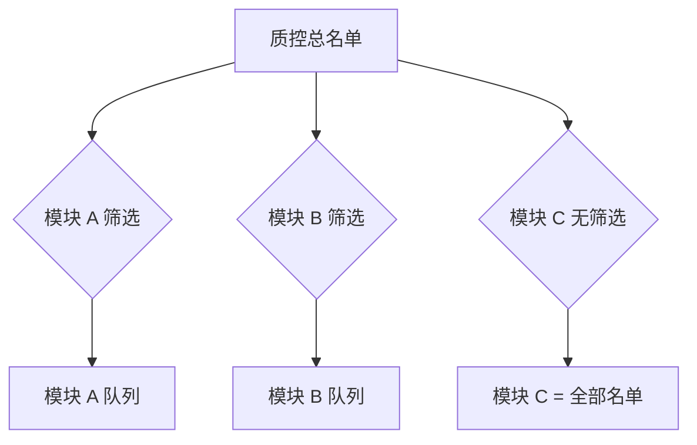
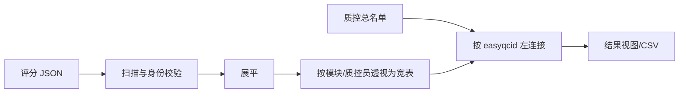

# EasyQC 核心逻辑与灵活性

## 1. 一个稳定的心智模型

EasyQC 的通用性不是来自让用户执行任意代码，而是来自一组边界清楚、可以组合的对象：

```text
Project
├── Master QC list
│   ├── easyqcid                  稳定行身份
│   └── arbitrary row columns    路径、批次、模态、指标等
├── Project constants            对每一行相同的值
└── QC modules
    ├── module_name + label
    ├── rater
    ├── independent row filter
    ├── score definitions
    ├── tag definitions
    ├── notes
    ├── viewer command template
    └── current rating snapshots
```

这套模型把“有哪些对象需要检查”“某个任务检查哪些对象”“用什么工具看”“如何判断”“谁做了判断”拆开。每部分可独立改变，同时由稳定身份重新关联。

## 2. 质控条目：最小通用单位

总名单的一行称为质控条目（QC record / QC item）。`easyqcid` 是条目的业务主键，必须：

- 非空；
- 在总名单中精确唯一；
- 大小写折叠后仍唯一，例如 `SUB01` 与 `sub01` 不能并存；
- 满足 `^[A-Za-z0-9_.-]{1,128}$`；
- 不是 `.` 或 `..`。

除了 `easyqcid`，其余列没有固定领域语义。一个项目可保存 `site`、`visit`、`t1_path`、`bold_path`、`pipeline_version` 或自动 QC 指标等任意普通列。

### 为什么这比“受试者表”更灵活

若强制一行等于一名受试者，多访视、多模态、多处理版本会被塞进复杂的宽表或非唯一键。通用条目模型允许用户先决定真实检查单位，再为它分配 `easyqcid`。因此同一应用可以服务于参与者级、扫描级和产物级 QC。

### 代价

EasyQC 不替用户建立研究数据本体。`easyqcid` 如何映射到 participant/session/run，需要通过名单列和项目文档表达。

## 3. 一份总名单，多个独立模块队列

总名单是项目级权威集合。每个 QC 模块保存自己的结构化筛选表达式：



- 模块筛选为空时，队列就是总名单的全部条目，保持源顺序。
- 模块筛选只选择行，不保存名单副本作为最终权威。
- 每个模块独立保存筛选；修改模块 A 不改变模块 B。
- 启动 QC 时重新在当前总名单上解析筛选，因此已删除或新增的名单行会反映到队列。
- 保存筛选前会验证匹配身份；后台提交时还会检查项目设置和匹配结果没有过期。

模块过滤使用与表格工作区相同的类型感知 Filter Builder，而不是要求用户编辑 JSON 或 SQL。

### 设计巧思：规则而不是复制

若每个模块保存独立 CSV，名单更新很容易产生多个不一致副本。保存筛选规则使总名单保持单一权威，同时又给每个模块独立队列。项目目录中可以存在模块相关派生表，但运行时模块队列的逻辑权威是总名单加模块筛选。

## 4. 行变量与项目常量

查看器命令上下文由两类值组成：

```text
当前总名单行的所有列  +  项目常量  =  当前条目的查看器变量
```

例如：

| 来源 | 名称 | 示例 |
|---|---|---|
| 行变量 | `easyqcid` | `sub-001_ses-01` |
| 行变量 | `t1_path` | `/data/sub-001/anat/T1w.nii.gz` |
| 行变量 | `site` | `A` |
| 项目常量 | `FREESURFER_HOME` | `/opt/freesurfer` |
| 项目常量 | `SUBJECTS_DIR` | `/project/derivatives/freesurfer` |

常量适合不随行变化的路径、可执行文件或参数；行变量适合每个条目不同的值。两者名字不得重叠：在导入名单、添加常量或启动查看器时都会检查冲突并明确失败。

### 设计巧思：变量覆盖不是隐式规则

许多模板系统采用“后面的值覆盖前面的值”，但这会使命令的真实输入依赖不明显的优先级。EasyQC 禁止重名，使每个占位符只有一个来源。

## 5. 模块是完整检查任务

一个模块不是一列评分，而是以下要素的组合：

```text
selection + inspection + judgment + ownership
```

- **selection**：模块筛选决定哪些条目进入队列。
- **inspection**：查看器命令决定如何打开与该条目相关的数据。
- **judgment**：scores、tags、notes 决定如何记录人工判断。
- **ownership**：`module_name` 与 `rater` 决定评分归属。

这使模块能够表达一个可复用、可审查的质控任务。显示标签可以面向人类使用中文或长文本；内部 `module_name` 则使用短、稳定、可移植的 ASCII 标识。

## 6. 配置扩展，而不是任意代码扩展

EasyQC 采用两个受控扩展面：

### 6.1 查看器命令模板

命令模板允许把行变量和项目常量传给外部应用。用户选择直接执行或系统 Shell；EasyQC 不设可执行程序黑白名单，但负责单次占位符展开、命令拆分、启动错误和进程生命周期。

### 6.2 EasyQC Formula

新增列使用受限的 Excel/VBA 风格单表达式：列引用、字面量、算术、比较、逻辑、文本/路径/条件函数。解析器只生成封闭 AST，执行器只调用已登记的向量化运算；没有 `eval`、Python 语句、SQL、完整 VBA、正则或文件系统访问。

这两者边界不同：Formula 只计算表格数据；查看器命令会启动真实外部进程。不能因为 Formula 是受限的，就把查看器命令误称为沙箱。

## 7. 模板是复制起点

跨项目设置中可保存常量模板和模块模板，它们位于当前 EasyQC 安装目录：

```text
easyqc/
├── constant_templates.json
├── app_settings.json
└── modules/<template-module-id>.json
```

模板不会自动进入项目。用户选择“从模板添加”后：

1. 可以在复制前修改候选名称、值或模块内容；
2. 系统检查当前项目中的名称冲突；
3. 成功后写入项目自有配置；
4. 后续模板与项目副本互不同步。

### 为什么不做继承或全局启用

隐式继承会让一个项目在模板改变后悄然改变，也会使不同 EasyQC 版本共享用户级状态时发生污染。copy-only 语义把复用发生的时点变成一次明确操作，之后项目保持自包含。

## 8. 评分事实与结果投影

每个 `(module_name, rater, easyqcid)` 对应一个当前评分 JSON。保存相同三元组时覆盖旧快照；不同模块或质控员落在不同目录和文件名中。

```text
RatingFiles/<module_name>/<rater>/
  <module_name>-<rater>-<easyqcid>.json
```

结果视图不是另一套独立事实：



因此：

- 删除总名单中的行或普通列不会删除评分 JSON；
- 结果刷新会从当前评分事实重建；
- 评分扫描发现损坏、错位、重复或大小写冲突时，结果构建整体失败，而不是静默忽略；
- 删除名单行后，对应评分仍保留，但不再出现在以当前总名单为左表的结果投影中。

### 设计巧思：保留事实，允许整理名单

名单是当前工作范围，评分是已经发生的人工事实。把“整理名单”与“删除评分证据”分开，避免一次清理操作不可逆地丢失人工记录。

## 9. 完整模块快照

评分 JSON 包含当时完整模块载荷，而不是只保存分值：

- 模块内部名和标签；
- 质控员与 `easyqcid`；
- score 的标签、允许选项和当前值；
- tag 的标签和布尔值；
- 查看器命令、实际展开命令和控制选项；
- 模块筛选、备注和保存时间；
- `schema_version: 3`。

这带来两个能力：

1. 复查旧记录时可以使用保存时的评分结构解释它；
2. 当前模块改变后，历史评分仍具有自身语义。

当前 GUI 从右键“已有质控记录”打开时默认只读；用户可取消手动只读继续编辑。同一三元身份保存后仍是最新快照，并不产生不可变事件历史。

## 10. 身份冗余不是浪费

模块、质控员和条目身份同时存在于目录、文件名和 JSON 正文：

```text
目录:  ModuleA/Rater1/
文件:  ModuleA-Rater1-sub-001.json
正文:  name=ModuleA, rater=Rater1, easyqcid=sub-001
```

扫描时三者必须一致。冗余的目的不是压缩存储，而是在文件被误移、混放或手工修改后及时发现问题。对于小型 JSON，这点额外体积远小于静默错配的风险。

## 11. 失败方式与限制

- 模块筛选引用已删除列时，模块不能启动，直到修改筛选或恢复列。
- 查看器模板中的 `${name}` 或 `{name}` 缺少变量时明确失败；裸 `$name` 为兼容 Shell 变量不做同样的未解析拒绝。
- 评分结构与当前模块不兼容时，当前记录会进入强制只读状态。
- 评分文件发生身份或结构错误时，聚合不会生成部分结果。
- copy-only 模板不提供跨项目自动同步。
- 当前没有数据库事务、远程锁服务或多机协作协议。

## 12. 相关文档

- 数据和服务如何连接：[架构与数据流](03-architecture-and-data-flow.md)
- 如何构建和操作名单：[名单与表格工作区](05-qc-list-and-table-workspace.md)
- Formula 语法：[新增列与 EasyQC Formula](06-derived-columns-and-easyqc-formula.md)
- 模块具体配置：[常量、模块与外部查看器](07-constants-modules-and-viewers.md)
- 评分持久化：[评分、复查与结果](08-qc-rating-review-and-results.md)
