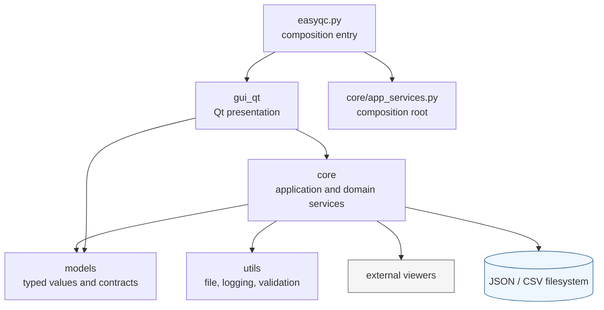
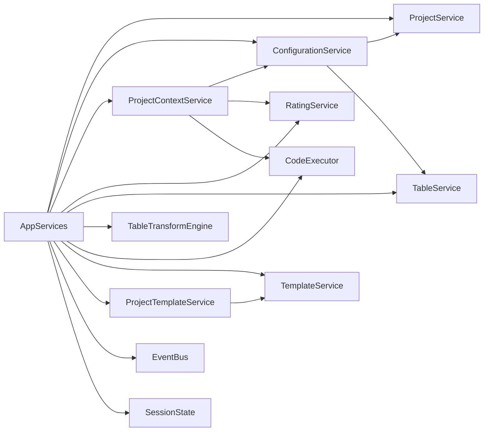
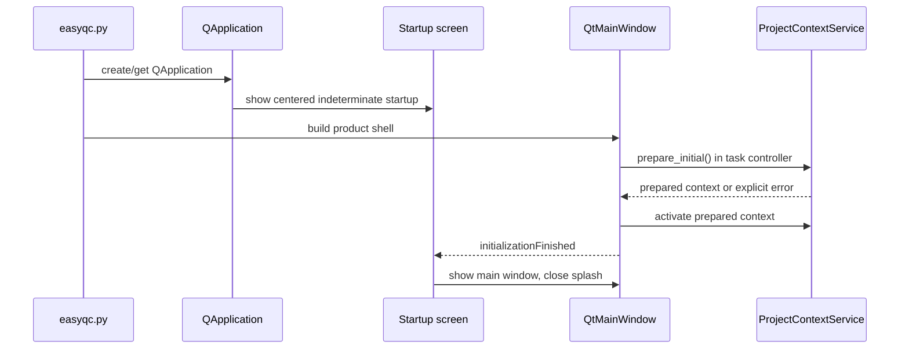
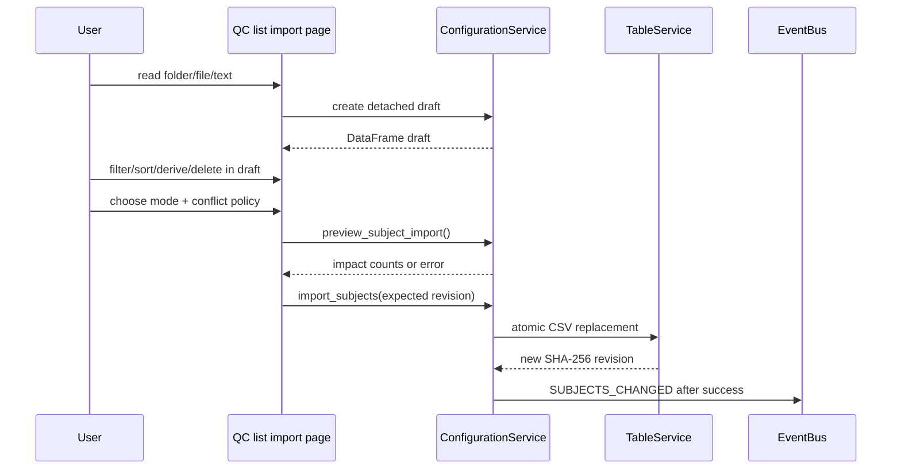
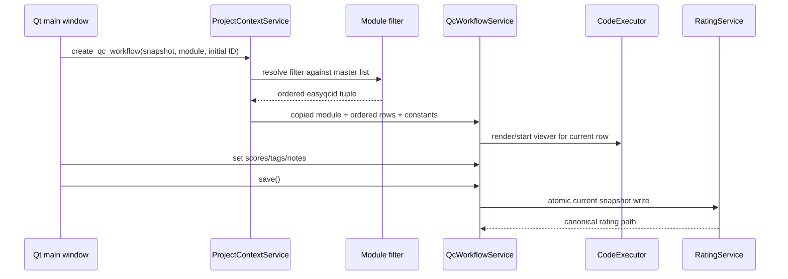

# EasyQC 架构与数据流

## 1. 架构目标

当前 EasyQC 架构围绕四个约束展开：

1. GUI 在 Ubuntu、Windows 和 macOS 上尽量使用同一套 Qt Widgets 代码与原生布局行为。
2. 质控业务逻辑不依赖 GUI，使主窗口、独立 QC 窗口和 CLI 直达路径共享相同合同。
3. JSON/CSV 是可读、可备份的权威存储，不引入数据库。
4. 表格、配置、查看器和评分的写入都必须经过 Core 边界，不允许 GUI 直接拼接业务状态。

## 2. 分层与依赖方向



必须保持的方向是：

```text
GUI → Core → Models
          → Utils
```

- Core 不导入 GUI。
- Models 不导入项目内部模块。
- GUI 可以读取模型值并调用 Core，但不成为数据权威。

架构测试 `tests/test_architecture/test_project_layering.py` 对关键层级关系提供自动化守卫。

## 3. 主要目录职责

| 目录/入口 | 职责 |
|---|---|
| `easyqc.py` | 参数解析；创建唯一 Qt 入口；四参数 CLI 直达 QC |
| `gui_qt/` | 主窗口、七个导航页、表格、对话框、QC 控制器、主题与 i18n |
| `core/` | 项目、配置、名单、表格、公式、模块、评分、查看器、平台与安装服务 |
| `models/` | `Project`、`QCModule`、`Rating`、表格状态、公式与平台合同 |
| `utils/` | 原子文件写入、日志、基础验证 |
| `scripts/` | 测试矩阵、基准、迁移和平台验证工具 |
| `tests/` | Core、Models、Qt、脚本、打包与架构测试 |

项目使用 flat layout：仓库根本身是运行目录，`core`、`models`、`gui_qt` 是并列模块；不是通过 `pip install easyqc` 安装的标准包。

## 4. 组合根与共享服务图

`core/app_services.py` 构造一个 `AppServices`，供主 GUI 与 CLI QC 路径共享：



关键角色：

- `ProjectService`：项目登记、schema-v3 设置、项目模块目录和乐观提交。
- `ConfigurationService`：GUI 可用的事务化名单、常量和模块操作。
- `ProjectContextService`：把当前项目、名单、常量、模块和评分装配为一致快照。
- `RatingService`：评分路径、扫描、严格校验、保存、展平和聚合。
- `TableViewService`：只读表格视图状态、筛选、排序、分页窗口和 QC 身份验证。
- `TableTransformEngine`：类型化表格变换和 Formula 物化。
- `CodeExecutor`：查看器模板展开、直接/Shell 执行和进程组生命周期。
- `TemplateService`：当前安装的 copy-only 模板与命令执行设置。

## 5. 项目上下文快照

GUI 不应在多个时点分别读取项目、名单和评分，否则可能组合出不一致状态。`ProjectContextService` 先在后台准备候选快照：

```text
PreparedProjectContext
├── PreparedProjectLoad
├── detached master-list DataFrame
├── detached constants
├── detached QCModule tuple
├── validated Rating tuple
├── rating positions by easyqcid
└── TableViewService over projected table
```

候选完整成功后才激活项目。损坏的新项目不会留下“current 指向新项目、settings 仍来自旧项目”的半切换状态。

每个激活上下文带 `context_revision`。后台操作返回时，GUI 检查修订是否仍属于当前项目；过期结果不会覆盖新上下文。

## 6. 启动路径

### 6.1 常规 GUI



启动窗口在当前指针所在屏幕的可用区域居中，至少显示约 500 ms；项目加载不是伪进度条，而是明确的未知时长状态。

### 6.2 CLI 直达 QC

```bash
python easyqc.py <project> <module> <rater> <easyqcid>
```

CLI 先验证四个身份并解析项目，然后使用同一 `AppServices` 和 `ProjectContextService` 构造 `QcWorkflowService`，最后打开相同的 Qt QC 控制器。它不是另一套 GUI 或另一种评分持久化。

## 7. 名单导入与写回



导入草稿不是权威数据。只有明确点击“写入质控前名单”并通过冲突预览后，`easyqc_all.csv` 才会改变。

## 8. 表格视图数据流

`TableViewService` 保存源 DataFrame 的私有副本。用户操作产生不可变 `TableViewState`：

- `ColumnViewState`：顺序、隐藏、宽度、固定列；
- `FilterExpression`：分组条件与 AND/OR；
- `SortRule`：有优先级的多列排序；
- 分页大小、密度和修订。

应用状态后返回的 `TableViewResult` 只保存源位置数组、源总数和匹配总数。GUI 按页调用 `get_window()` 获取有限行，不把整个 DataFrame 复制进 Qt model。

固定列与普通列是两个协调的 `QTableView` 展示区；它们共享行窗口、选中状态和纵向滚动，横向滚动只作用于普通列区。`easyqcid` 必须位于第一列、可见且固定。

## 9. 模块队列与 QC 会话



`QcWorkflowService` 持有一个工作副本。未保存状态不会直接修改项目模块；切换记录或关闭窗口时若有草稿，Core/GUI 会拒绝或要求明确放弃。

## 10. 评分持久化与结果重建

评分路径由 `RatingIdentity` 构造，不由 GUI 拼接。保存流程包括：

1. 验证模块、质控员和条目标识；
2. 构造唯一规范路径；
3. 获取项目级跨线程/跨进程写锁；
4. 检查大小写同名和已有正文身份；
5. 写入唯一临时文件，flush + `fsync`；
6. `os.replace` 原子发布；
7. 成功后发布 `RATING_SAVED` 事件。

读取聚合时，`RatingService` 不跟随符号链接，并验证目录深度、目录/文件名/正文身份、schema 版本、重复三元组和大小写冲突。任何错误都保留路径并阻断正式聚合。

## 11. 事件与刷新

`EventBus` 是进程内、类型化、按订阅顺序分发的总线。主要事件包括：

- `PROJECT_CHANGED`
- `MODULES_CHANGED`
- `SETTINGS_SAVED`
- `SUBJECTS_CHANGED`
- `RATING_SAVED`
- `RATINGS_LOADED`

事件只表示“权威操作成功后发生了变化”，不携带大型 DataFrame。主窗口收到事件后重新准备上下文。事件处理器异常会记录完整错误，并继续通知其他订阅者；它不会 `except: pass`。

## 12. GUI 线程边界

项目装载、结果刷新、Formula 完整数据提交、模块筛选保存和 CSV 导出通过修订感知的后台任务控制器运行。Qt 控件只在 GUI 线程更新。长任务具有 busy 状态，相关按钮被禁用；返回值的修订不再匹配时被视为过期，不应用到当前界面。

这是一种响应性策略，不代表所有 pandas 运算天然常数时间。性能合同与基准见[可靠性、性能与平台](09-reliability-performance-and-platforms.md)。

## 13. 权威与派生数据表

| 数据 | 权威位置 | 是否可重建 | 主要写入者 |
|---|---|---|---|
| 项目登记 | 安装根 `projects.json` | 否 | `ProjectService` |
| 项目设置 | `settings_<project>.json` | 部分模块映射可从模块文件同步 | `ProjectService` |
| 项目模块 | `modules/<uuid>.json` | settings 中有一致映射，但目录为严格读取来源 | `ModuleRepository` / `ProjectService` |
| 总名单 | `Table/easyqc_all.csv` | 否，除非有外部原始来源 | `TableService` |
| 当前评分 | `RatingFiles/.../*.json` | 否 | `RatingService` |
| 结果宽表 | 运行时投影；可导出 CSV | 是 | `RatingService` + `TableExportService` |
| 表格视图状态 | 内存 | 是 | `TableViewService` |
| Formula 文本 | 不保存 | 不需要 | 仅对话框草稿 |
| 日志 | 平台用户日志目录或 `EASYQC_LOG_DIR` | 否 | `utils.logger` |

## 14. 失败行为与架构限制

- Core 发现合同错误时抛出具体异常；GUI 显示错误，不使用空结果替代失败。
- 本地文件锁防止同一项目并发写入，但不是网络文件系统上的分布式一致性协议。
- `projects.json` 与安装模板跟随当前源码/安装根；同一机器上的两个独立检出不会自动共享它们。
- settings 和 rating 只读 schema v3；没有运行时双格式兼容层。
- flat layout 简单稳定，但不能当作普通 PyPI 包导入。
- `SessionState` 保留部分历史命名和内存缓冲角色；当前 Qt 主路径的权威装配是 `ProjectContextService`。

## 15. 相关文档

- 产品取舍：[架构决策](../architecture-decisions.md)
- 文件和 schema：[安装与项目管理](04-installation-and-project-management.md)
- 表格合同：[名单与表格工作区](05-qc-list-and-table-workspace.md)
- 评分安全：[评分、复查与结果](08-qc-rating-review-and-results.md)
