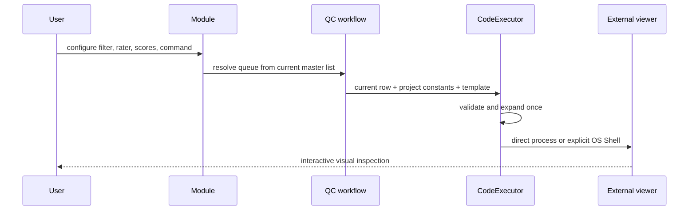

# EasyQC 常量、模块与外部查看器

## 1. 查看器执行上下文

EasyQC 不把影像路径写死在模块代码中。每次打开一个质控条目时，它构造：

```text
当前行的全部列 + 项目常量 = 当前 viewer command 上下文
```

行变量描述每条记录不同的值，例如 `t1_path`、`visit`、`subject_dir`；项目常量描述对整个项目相同的值，例如查看器路径、数据根目录或模板表面。

常量名必须是非空合法标识符。项目常量不能与总名单列重名，否则 `${name}` 无法确定应采用哪个来源。新增或改名时即阻止冲突，而不是到执行查看器时再猜测优先级。

## 2. 常量模板与项目常量

“跨项目设置”可维护当前 EasyQC 安装的常量模板。“常量设置”可从模板复制：

- 模板只是起点，不自动对项目生效；
- 复制前可修改名称和值；
- 复制后成为项目自有常量；
- 后续修改模板不会同步项目；
- 项目常量可继续编辑或删除。

copy-only 比全局继承多一次明确操作，但保证旧项目不会因另一个项目或软件升级而悄然改变。

## 3. 一个 QC 模块包含什么

模块把一次质控任务的选择、显示、判断与责任人组合在一起：

| 字段 | 作用 |
|---|---|
| `module_name` | 稳定内部身份和评分目录名 |
| label | 面向用户的显示名称，可使用更自然的文本 |
| rater | 当前质控员身份；为空时强制只读 |
| scores | 一个或多个评分维度及允许选项 |
| tags | 一个或多个布尔标记 |
| notes | 每条记录的自由文本备注 |
| viewer command | 外部查看器命令模板 |
| process control | 切换记录时是否关闭前一个托管进程组 |
| queue filter | 当前模块独立的结构化名单筛选 |

模块名和 rater 都限制为 1–32 个 ASCII 字母、数字或下划线，不允许短横线。显示 label 不承担文件身份职责，因此可以更友好。

项目模块名大小写不敏感地唯一。`T1_QC` 与 `t1_qc` 不能并存，以避免跨平台文件系统差异。

## 4. 独立模块名单

每个模块保存自己的 Filter Builder 表达式。筛选为空时使用总名单；存在筛选时，启动前在当前总名单上解析得到有序 `easyqcid` 队列。

例如：

- `T1_QC`：`t1_path notna`；
- `BOLD_QC`：`bold_path notna AND mean_fd > 0.2`；
- `SEG_QC`：`segmentation_status == "ready"`。

这些队列互不覆盖。修改总名单后，下次启动会重新解析规则；若规则引用已删除列，模块启动失败并要求修正配置。

## 5. 模块模板

安装级模块模板保存在当前仓库的 `modules/`，每个模板一个 JSON。项目页选择“从模板添加”时：

1. 读取模板候选；
2. 清除运行时记录身份；
3. 要求项目中新的非冲突模块名；
4. 生成新的项目模块文件；
5. 之后允许完整编辑。

模板不是只读挂载，也不会自动启用到所有项目。这避免系统模板与项目模块存在两套运行时解析优先级。

## 6. 模块身份的生命周期

评分路径包含 `module_name`，所以已有评分后模块身份受到保护：

- 已产生评分的模块不能改名；
- 删除模块配置不会删除评分 JSON；
- 已被评分占用的旧名字不能直接复用为另一个任务；
- 想改变显示文字可以修改 label，而无需改变内部身份。

这是文件可恢复性与用户便利之间的取舍。模块名短而稳定，标签负责可读性。

## 7. 占位符语法

查看器模板支持：

```text
${name}
{name}
$name
```

推荐 `${name}`，因为边界最清楚。`${name}` 和 `{name}` 缺少变量时立即失败；裸 `$name` 可能是有意保留给 Shell 的环境变量，因此不能一律判为 EasyQC 缺失变量。

展开是单次的。例如变量 A 的值恰好包含 `${B}`，不会再次递归展开 B。单次展开可避免值注入出新的隐藏占位符链。

## 8. `shell=False`：默认直接执行

默认模式把命令解析为可执行程序和参数，然后直接创建进程：

```text
viewer ${image_path}
```

在该模式下，管道、重定向、`&&`、Shell 通配符和命令替换不会由 Shell 解释。优势是参数边界清楚，路径中的空格可按解析规则作为一个参数传递，行为较少依赖用户的默认 Shell。

`shell=False` 不是“禁止外部程序”。它仍会以当前操作系统用户权限启动指定可执行文件。

## 9. `shell=True`：显式使用系统 Shell

用户可在“跨项目设置”的执行设置中把 viewer command 改为 `shell=True`。此时完整命令交给操作系统 Shell，因而可以使用：

- 管道和重定向；
- 环境变量展开；
- 命令链接；
- Shell 自身的引号与通配符规则。

EasyQC 不对可执行程序名称设置 allowlist 或 denylist。两种模式都不是沙箱；`shell=True` 只是扩大了命令字符串的解释能力，也扩大了错误或不可信模板的风险。只应运行用户理解并信任的命令，权限边界就是当前登录用户权限。

### 9.1 冻结版与外部查看器环境

PyInstaller 冻结版必须为 EasyQC 自身设置私有动态库和 Qt 插件路径，但这些
路径不能继续传给 Freeview、FSLeyes 等独立程序。EasyQC 启动外部查看器时会
创建子进程专用环境：Linux 恢复冻结前的 `LD_LIBRARY_PATH`（没有原值时移除
它），并移除只属于 EasyQC 的 `QT_PLUGIN_PATH` 和 `QML2_IMPORT_PATH`；普通
`PATH`、`DISPLAY`、`XAUTHORITY`、`FREESURFER_HOME`、`SUBJECTS_DIR` 等用户
环境保持不变。EasyQC 自身的环境不会被修改。

该处理解决冻结包动态库污染，但不会自动加载 `.bashrc` 或
`SetUpFreeSurfer.sh`。若 FreeSurfer 只在交互终端初始化，应从已初始化的同一
终端启动 EasyQC，或在可信的模块命令中明确调用固定路径的初始化脚本。优先
使用查看器绝对路径，可以把“未初始化 PATH”和“动态库冲突”区分开。

查看器若在启动探测期内以非零状态退出，EasyQC 会显示经过长度限制的 stderr
摘要并写入日志，而不是只表现为按钮没有反应。摘要是外部程序输出，仅用于
诊断，不会被 EasyQC 当作命令再次执行。

## 10. 多命令与进程控制

命令模板可以使用 `MULTICMD` 与 `;|` 描述按顺序启动的多个命令。该协议由 `CodeExecutor` 统一解析，而不是 GUI 自己拆字符串。

若模块启用进程控制，切换记录时 EasyQC 可关闭上一个由它托管的进程组，再启动下一条命令。这适合“每个 QC 条目只保留一个查看器实例”的流程。未被 EasyQC 托管的外部进程不在这一生命周期内。

## 11. 查看器命令示例

以下只是结构示例，可执行文件路径和参数必须以本机查看器官方文档为准。

### 11.1 单一图像

```text
fsleyes "${t1_path}"
```

### 11.2 图像与分割叠加

```text
itksnap -g "${t1_path}" -s "${seg_path}"
```

### 11.3 项目根常量加相对行路径

```text
freeview -v "${SUBJECTS_DIR}/${subject_rel}/mri/T1.mgz"
```

### 11.4 多个查看器步骤

```text
MULTICMD viewer_a "${image_a}" ;| viewer_b "${image_b}"
```

若需要 Shell 管道，应明确启用 `shell=True` 并在测试项目上验证；不要把未经审核的研究数据字符串拼成命令片段。

## 12. 从配置到执行



## 13. 失败行为与排查方向

| 情况 | 行为 |
|---|---|
| 常量和名单列重名 | 配置阶段拒绝 |
| 模块名/rater 不合法 | 保存或启动前拒绝 |
| 模块名 case-only 重复 | 不写入项目 |
| brace 占位符缺失 | 不启动进程并显示变量名 |
| 可执行程序不存在 | 保留操作系统启动错误 |
| 冻结包私有 Qt/动态库污染 | 仅对子进程恢复系统环境 |
| 查看器启动后立即非零退出 | 显示退出码和受限 stderr 摘要 |
| 命令引号不匹配 | 解析失败，不尝试猜测修复 |
| 历史模块身份已被评分占用 | 禁止改名或复用 |
| 空 rater | 强制只读 QC |

查看器启动错误的详细诊断见[参考与故障排查](10-reference-and-troubleshooting.md)。

## 14. 相关文档

- [核心逻辑与灵活性](02-core-logic-and-flexibility.md)
- [评分、复查与结果](08-qc-rating-review-and-results.md)
- [可靠性、性能与平台](09-reliability-performance-and-platforms.md)
