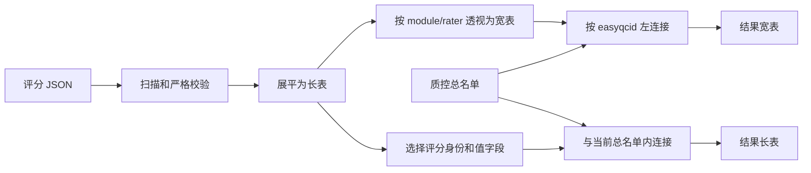

# EasyQC 评分、复查与结果

## 1. 一次 QC 会话的身份

EasyQC 把当前评分快照定义为一个严格三元组：

```text
(module_name, rater, easyqcid)
```

- `module_name` 标识组织一个或多个检查任务的配置模块；
- `rater` 表示质控员；
- `easyqcid` 表示被检查的通用质控条目。

相同条目由不同模块检查，或由不同质控员检查，都会得到不同身份。保存同一三元组时原子覆盖其最新快照；EasyQC 不在同一路径下累积每次点击保存的事件历史。

## 2. 启动质控

可以从三类入口进入 QC：

1. 在“质控模块”选择一个模块并启动；
2. 在质控前名单或结果表右键当前行，选择适用模块；
3. 使用四参数 CLI 直达指定条目。

启动前 Core 会在当前总名单上解析模块自己的筛选规则，并验证初始 `easyqcid` 确实属于该队列。空 rater 的模块只能以只读方式打开，因为没有合法质控员身份就不能形成可保存三元组。

## 3. QC 窗口布局

窗口标题使用：

```text
EasyQC · <module_name> · <rater>
```

主要区域包括：

- 左侧/主区域的模块队列表格，默认约显示 8 行；
- 评分项，使用可按下的矩形选项按钮，并含“未评”；
- 标签，尽量放在一条可横向滚动的行中；
- 备注编辑区；
- 右侧纵向操作列：只读、筛选名单、上一个、下一个、保存、保存并下一个。

窗口高度根据评分项、标签和备注内容计算，但不会超过当前屏幕可用区域。用户向下拉大窗口时，额外空间优先给队列表格，而不是产生大片无效空白。按钮列总高度与表格区域协调，避免评分结构增多后控件被截断。

## 4. 导航与查看器

双击队列中的一行会：

1. 请求切换到该 `easyqcid`；
2. 加载该身份已有的当前评分；
3. 使用当前行变量和项目常量展开查看器模板；
4. 按模块进程控制策略启动查看器。

“上一个”和“下一个”沿当前模块队列移动，而不是沿未筛选总名单移动。改变模块筛选后会得到新的会话队列。

若当前评分、标签或备注有未保存修改，切换记录、替换筛选或关闭窗口会被阻止，直到用户保存或明确放弃草稿。程序不会为了继续导航而静默丢弃输入。

## 5. 评分操作

每个 score 有自己的允许值。点击矩形选项后保持按下状态；“未评”表示没有选择有效评分，而不是一个普通数值。tag 是独立布尔状态，notes 保存自由文本。

按钮行为：

| 操作 | 行为 |
|---|---|
| 上一个/下一个 | 仅导航；有未保存草稿时先阻止并提示 |
| 保存 | 保存当前三元身份并留在当前行 |
| 保存并下一个 | 保存成功后才导航到下一行 |
| 只读 | presentation-level 开关；启用时禁止编辑/保存 |
| 筛选名单 | 使用与总名单一致的 Filter Builder 构建本次模块队列 |

保存失败时当前位置和草稿保留，不会假装已经进入下一条。

## 6. 打开已有评分

质控前名单、质控结果和活动 QC 队列的右键菜单会列出该行精确存在的评分记录。选择一条记录时，EasyQC：

- 读取评分 JSON 中保存的完整模块快照；
- 使用该快照的评分项、标签、命令和队列筛选解释历史记录；
- 将保存的模块筛选规则应用于当前总名单，构建复查队列，并加载队列中其他条目的当前评分；
- 默认勾选“只读”；
- 允许用户手动取消 presentation-level 只读，然后编辑并保存。

“默认只读”是防误改体验，不是不可取消的历史锁。只有下列 Core 合同才会强制只读：

- 保存快照与可编辑模型不兼容；
- 模块本身处于 watch mode；
- 没有合法 rater；
- 其他身份/结构安全条件不允许写入。

这里的“已有评分”指该三元身份当前保存的记录。软件没有保存旧名单版本；如果条目已不在当前总名单中、保存的筛选不再匹配该条目，或筛选引用的列已被删除，原评分 JSON 可以仍然存在，但此入口不能自动恢复当时的检查环境。重新启动查看器使用保存的命令模板与当前名单字段、当前项目常量。

## 7. 当前快照覆盖语义

规范路径为：

```text
RatingFiles/<module_name>/<rater>/
  <module_name>-<rater>-<easyqcid>.json
```

再次编辑相同身份时写回同一路径。不同模块或 rater 的目录和文件名不同，因此不会互相覆盖。

目录、文件名和 JSON 正文都重复声明身份。保存前若目标正文声明的是另一身份，程序拒绝覆盖；扫描时若三处不一致，也会报告损坏。这种少量冗余帮助发现文件被手工移动、混放或错误重命名后的风险。

## 8. 评分 JSON 保存什么

schema-v3 评分不是只有分数的稀疏记录，而是保存时的完整模块快照，包括：

- `schema_version: 3`；
- 模块内部名、label、rater 和 `easyqcid`；
- score 的 label、允许值与当前值；
- tag 的 label 与严格 JSON Boolean 值；
- notes 与保存时间；
- 查看器命令模板与本次展开命令；
- 进程控制、显示和模块名单筛选相关设置。

完整快照使后续模块配置变化后，旧评分仍携带解释自身所需的上下文。它仍是“最新状态快照”，不是不可变审计日志。

其中 `notes` 是模块级单一文本字段；`Score` 和 `Tag` 没有独立备注。完整模块快照也不包含整份总名单、项目常量表、应用级 Shell 选择、外部脚本内容、查看器版本或切片位置、缩放和图层等交互状态。需要固定某轮评分范围时，应在 EasyQC 之外保存相应名单、配置和环境。

## 9. 严格扫描

构建结果前，`RatingService` 扫描 `RatingFiles/`，并拒绝：

- 非法 JSON 或错误 schema；
- 不符合规范目录深度的 JSON；
- 评分目录或文件的符号链接；
- 目录、文件名与正文身份不一致；
- 同一三元身份出现两个文件；
- module、rater 或 `easyqcid` 的大小写折叠冲突；
- 评分/tag 数据类型不符合合同。

任何扫描错误都会使正式聚合整体失败，并保留问题路径。系统不会跳过坏文件后输出一个看似完整、实际缺失记录的结果表。

## 10. 结果表如何重建



评分字段使用稳定宽表命名：

```text
<module>.<rater>.<field>
```

例如 `T1_QC.rater1.score1`、`T1_QC.rater1.tag1`、`T1_QC.rater1.notes` 和 `T1_QC.rater1.time`。备注列没有数字后缀。代码模板和实际执行命令不作为常规结果分析列暴露。

宽表以总名单为左表；用户长表以评分事实与当前总名单的交集为范围，因此：

- 未保存评分的条目仍出现在宽表中，对应评分列为空；长表不为它生成空白评分行；
- 长表每行对应 `(easyqcid, module_name, rater)`，附加总名单普通列，并保留 `scoreN`、`tagN`、`notes` 和 `time`；
- 名单列与长表评分字段重名时，名单列加 `master.` 前缀，必要时重复添加直到无冲突；
- 删除总名单行不会删除其 JSON，但该身份不出现在当前长表或宽表；
- 恢复同一 `easyqcid` 到总名单并刷新后，保留的评分可以重新连接。

内部原始展平表还含配置与路径信息，并可包含已从总名单移除的评分；它不是结果页展示和导出的用户长表。两种用户结果都不会自动统一不同模块的量表含义，同名 `score1` 是否可比较仍取决于评分定义。

## 11. 结果页操作

结果刷新在后台执行，成功后替换当前结果模型；若项目在期间发生切换，过期任务不会写入新项目界面。兼容的筛选、排序和列状态尽量保留。

结果页支持：

- “切换为长表”／“切换为宽表”（快捷键 `Ctrl+Shift+L`）；
- 类型感知筛选；
- 多列排序；
- 列显示与重排；
- 分页；
- 右键进入模块或历史记录；
- 基于总名单普通列新增列；
- 导出当前投影 CSV。

Formula 不允许使用评分派生列作为源；新增列的结果写回总名单。导出则可以包含当前可见评分列，并按当前筛选、排序和列顺序输出。

两种模式分别保留自己的筛选、排序、列显示和分页状态。导出前先切换到目标模式；“导出…”输出当前模式下全部匹配行及可见列，范围不局限于屏幕上这一页。结果页本身只读，评分修改需要进入关联 QC 记录。当前 Qt 主路径在内存中重建结果，CSV 是用户导出的派生快照，并非每次保存评分都会自动保存一套长表和宽表。

## 12. 删除名单与保留评分

EasyQC 有意分离两种动作：

| 动作 | 改变总名单 | 改变评分 JSON |
|---|---:|---:|
| 删除总名单行 | 是 | 否 |
| 删除普通总名单列 | 是 | 否 |
| 删除模块配置 | 否 | 否 |
| 保存相同三元身份 | 否 | 覆盖该身份当前 JSON |

这样可以防止名单整理或配置清理带走已经付出人工成本产生的判断。相应代价是项目管理员必须通过备份和专门治理处理真正需要销毁的评分数据。

## 13. 失败行为与恢复

| 失败 | 安全结果 | 恢复方式 |
|---|---|---|
| 未保存草稿时导航 | 停留当前行 | 保存或明确放弃 |
| 目标 JSON 身份不一致 | 不覆盖原文件 | 备份后审计路径与正文 |
| 评分扫描发现坏文件 | 不生成部分结果 | 根据报告路径修复或从可信备份恢复 |
| 结果刷新过期 | 不替换当前界面 | 在当前项目重新刷新 |
| 导出取消/失败 | 旧目标文件不变 | 修正路径/权限后重试 |

## 14. 结果关联：跨条目共享评分显示

“质控前名单”和“质控结果”工具栏中的 **结果关联** 打开同一套项目级规则。规则只把已有来源评分显示到目标行，不复制评分 JSON，不改变原始总名单，也不自动判定通过或计算平均分。

### 14.1 一份结构像对应多个功能 run

例如总名单包含 `S01_anat`、`S01_rest01`、`S01_rest02`，三行的普通列 `subses` 都是 `S01`，`kind` 分别为 `anat`、`func`、`func`。

1. 结构像用自己的 `easyqcid` 在 `AnatQC` 模块中评分一次。
2. 打开“结果关联”→“添加规则”，填写关联名称。
3. 来源模块选 `AnatQC`，来源评分者选实际的评分者。
4. 来源匹配列和目标匹配列都选 `subses`；也可以选名称不同、含义相同的普通列。
5. “来源筛选…”设为 `kind == anat`，“目标筛选…”设为 `kind == func`。两侧均使用现有图形筛选器；不筛选时该侧以总名单为范围。
6. 勾选需要共享显示的评分、标签或备注字段，填写新列名，例如 `shared_anat_score`，再点击“应用”。

两个功能 run 行就都能看到带来源编号的结构像评分，例如 `S01_anat: Good`。关联来源按自己的模块和评分者读取，不会与其他人的评分混合。来源筛选明确决定关联范围；它不是自动从模块队列推断的分组。

### 14.2 多个功能 run 映射回结构像

再增加一条规则，来源改为 `RestQC` 的评分者，来源筛选 `kind == func`，目标筛选 `kind == anat`，匹配列仍为 `subses`，输出列例如 `linked_rest_scores`。结构像行会显示全部匹配来源，例如：

```text
S01_rest01: Good; S01_rest02: Poor
```

不会随机选第一条，也不会增加目标表的行数。右键目标行，在现有模块或评分记录菜单中选择来源条目，可以复查准确的 run。多个规则可双向并存，但都只读取原始总名单和原始评分，不读取另一条关联的输出，避免递归映射。

### 14.3 数据边界与维护

- 规则保存在项目设置 `result_associations` 中，重启项目后保留；每个项目独立配置。
- 关联输出是只读派生列；主表、结果宽表和长表刷新时重建。长表只给本来存在的评分行附加列，不为未评分目标创造评分行。
- 匹配值精确比较；空值/空字符串不匹配，不自动忽略大小写或把文本 `01` 变成数字 `1`。需要规范化时先用新增列建立统一匹配键。
- 找到来源但该来源尚无评分时显示 `来源编号: —`；没有匹配来源时输出空字符串。来源记录菜单只列出真实保存的评分。
- 修改并保存来源评分后，刷新结果会显示新的值；映射不是评分副本。删除关联规则只移除派生列和来源入口，不删除原始评分。
- 输出列名不能重复、覆盖普通列或占用系统结果命名空间。规则引用的匹配列/筛选列删除或重命名前，需先调整或删除规则；程序不会自动改写用户配置。
- 来源行必须仍在当前总名单中。移出名单不会删掉它的评分 JSON，但不再作为当前关联来源。
- 规则校验失败时不保存，弹窗保留草稿。若保存成功后界面刷新失败，会明确说明已保存，并允许重试刷新。

## 15. 相关文档

- [常量、模块与外部查看器](07-constants-modules-and-viewers.md)
- [可靠性、性能与平台](09-reliability-performance-and-platforms.md)
- [参考与故障排查](10-reference-and-troubleshooting.md)
- [方法描述与实现证据](13-methods-implementation-evidence.md)
