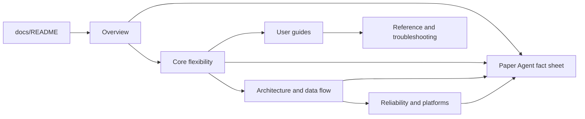

# EasyQC Documentation Suite Design

- Status: approved design, pending written-spec review
- Approved direction: modular, progressive documentation suite
- Date: 2026-08-03
- Product repository: `easyqc/`
- Target location: `easyqc/docs/`

## 1. Purpose

Create a detailed, internally consistent documentation suite that explains both
how EasyQC works and how to use it. The suite must make the product's flexible
core logic and its deliberate design ideas explicit, while remaining useful to
ordinary users, maintainers, and an Agent preparing a scientific software
paper.

The deliverable is documentation, not a manuscript draft. It must expose
verifiable project facts, explain design rationale, and separate implemented
behavior from tested evidence, demonstrations, limitations, and future plans.

## 2. Audiences and reading modes

The suite supports three audiences without maintaining three duplicated manuals:

1. **Users** need installation, project setup, list preparation, module
   configuration, rating, review, export, and troubleshooting.
2. **Maintainers** need architecture, authority boundaries, persistence rules,
   identity constraints, concurrency behavior, and platform assumptions.
3. **Paper-writing Agents and researchers** need precise positioning, core
   contributions, claim/evidence/limitation boundaries, terminology, and source
   pointers.

Chinese is the primary language. Stable English terms are retained on first use
and summarized in a bilingual glossary so later English manuscript writing does
not invent inconsistent translations.

## 3. Chosen information architecture

Use one landing page plus eleven numbered guides under `docs/guide/`:

```text
docs/
├── README.md
├── guide/
│   ├── 01-project-overview.md
│   ├── 02-core-logic-and-flexibility.md
│   ├── 03-architecture-and-data-flow.md
│   ├── 04-installation-and-project-management.md
│   ├── 05-qc-list-and-table-workspace.md
│   ├── 06-derived-columns-and-easyqc-formula.md
│   ├── 07-constants-modules-and-viewers.md
│   ├── 08-qc-rating-review-and-results.md
│   ├── 09-reliability-performance-and-platforms.md
│   ├── 10-reference-and-troubleshooting.md
│   └── 11-paper-agent-fact-sheet.md
├── architecture-decisions.md
└── superpowers/
```

This preserves the existing ADR summary and historical design specifications.
The new `guide/` directory is the current product documentation layer;
`superpowers/` remains design history rather than user-facing authority.

## 4. Canonical source policy

Documentation facts are resolved in this order:

1. Current code and current tests in the `easyqc/` Git repository.
2. `docs/PROJECT_SPEC.md` and active `dev/<task>/PROJECT_INDEX.md` records at the
   workspace root.
3. Current `easyqc/README.md` and `easyqc/docs/architecture-decisions.md` when
   they agree with code and tests.
4. `Paper/` files as writing input and comparative analysis only.
5. Archived or superseded material only for historical context.

No old tkinter fallback, pre-schema-v3 contract, obsolete test total, or
unverified platform claim may be restored from historical documents.

## 5. Common document pattern

Each guide should answer, as applicable:

- **What it is** — concept and scope.
- **Why it exists** — problem and design rationale.
- **How it fits** — upstream/downstream relationships.
- **How to use it** — numbered operation with concrete examples.
- **The design idea** — the deliberate "巧思" and its trade-off.
- **Failure behavior** — what is rejected and how users recover.
- **Limits** — what the feature does not prove or support.
- **Related documents** — relative links rather than duplicated prose.

Diagrams use Mermaid when a relationship or sequence is clearer visually.
Directory trees, compact tables, formula examples, and command examples are
used only where they improve comprehension.

## 6. Document responsibilities

### 6.1 `docs/README.md`

The documentation landing page contains the one-sentence positioning, reader
routes, a ten-minute conceptual path, the complete user workflow, document map,
current product boundary, and links to current evidence.

### 6.2 `01-project-overview.md`

Explain the manual visual QC problem, intended users, relation to automated QC
and task-specific renderers, product scope/non-goals, appropriate use, and
inappropriate use. Position EasyQC as a local configurable orchestration layer
that reuses professional neuroimaging viewers.

### 6.3 `02-core-logic-and-flexibility.md`

Own the central product mental model:

```text
project
  ├── master QC list
  ├── project constants
  └── independent QC modules
         ├── module-specific queue
         ├── rater
         ├── scores/tags/notes
         ├── viewer command
         └── ratings
```

Explain the core flexibility mechanisms and the principal design ideas:

- a row is a generic QC record, not necessarily a participant;
- one master list can feed independent module queues;
- row variables plus project constants form the execution context;
- a module composes selection, inspection, judgment, and ownership;
- modules are not hard-coded to one modality, pipeline, or viewer;
- installation templates are explicit copy-only starting points;
- list cleanup does not silently delete rating facts;
- historical ratings retain a full module snapshot;
- rating facts are authoritative and result tables are rebuildable;
- task configuration, module extension, and source-code extension are distinct.

### 6.4 `03-architecture-and-data-flow.md`

Document the sole Qt presentation, Core/Models/Utils layering, shared project
context, EventBus, normal and CLI entry paths, project/list/module/rating/result
flows, and authority/write-back boundaries. Include conceptual architecture,
rating traceability, and sequence diagrams.

### 6.5 `04-installation-and-project-management.md`

Cover supported Python/OS expectations, `setup.sh`, manual environments,
Ubuntu Qt runtime dependencies, launch commands, project create/import/switch/
remove, last-project restoration, project directory structure, copy-only
templates, backup, and the strict schema-v3 generation boundary.

### 6.6 `05-qc-list-and-table-workspace.md`

Cover file/text/directory imports, match modes and deeper-level extraction,
append/replace/merge/conflict behavior, `easyqcid` admission, filtering,
multi-column sorting, column display/order, row/column deletion, merge,
pagination, virtualized tables, fixed-column coordination, and row context
actions.

### 6.7 `06-derived-columns-and-easyqc-formula.md`

Explain why EasyQC uses a restricted single-expression formula rather than
SQL/Python/full VBA. Provide syntax, multi-column inputs, constants, text/path/
numeric/conditional/missing-value recipes, previews, row errors, ephemeral
formula semantics, closed function catalog, security boundary, and limits.

### 6.8 `07-constants-modules-and-viewers.md`

Cover constants, row variables, conflict rules, module/rater identities,
scores/tags/notes, independent queues, template copying, placeholder expansion,
`shell=False` versus explicit `shell=True`, process lifecycle, and worked
viewer-command patterns for representative professional viewers. State that
EasyQC is a process controller, not a sandbox.

### 6.9 `08-qc-rating-review-and-results.md`

Cover starting QC, current module/rater/record identity, read-only/edit mode,
navigation and save actions, opening historical ratings, row context menus,
current-snapshot overwrite semantics, multi-rater isolation, deterministic
rating paths, result-table reconstruction, filtering/derivation/export, and
the separation between list deletion and rating retention.

### 6.10 `09-reliability-performance-and-platforms.md`

Explain atomic JSON/CSV publication, write locks, revision/CAS checks, identity
redundancy, corruption/duplicate/symlink failures, measured table versus rating
file benchmarks, GUI responsiveness, Qt cross-platform layout strategy,
standard controls/system fonts/DPI, bilingual switching, verified Ubuntu scope,
and unverified native Windows/macOS claims.

### 6.11 `10-reference-and-troubleshooting.md`

Provide identifier regexes, directory and payload references, placeholder
syntax, a formula catalog link, common errors, xcb dependency diagnosis,
viewer failures, import/merge conflicts, duplicate identities, malformed
ratings, logs, backup, and recovery. Troubleshooting must preserve fail-loud
semantics rather than recommending deletion of evidence or bypassing checks.

### 6.12 `11-paper-agent-fact-sheet.md`

Provide a paper-oriented sourcebook: recommended positioning, contribution
candidates, design-idea inventory, Methods facts, claim/evidence/limitation
matrix, implemented/tested/demonstrated/planned labels, safe and unsafe claims,
version-bound performance evidence, limitations, suggested figures/tables,
bilingual terminology, and exact source/test/document pointers.

## 7. Cross-document data flow

The landing page routes readers to concepts first, then operations, then
reference. Each fact has one primary owner:



Other documents link to the primary owner instead of copying its complete
explanation. Examples may repeat only when needed to make an operation
self-contained.

## 8. Error and contradiction handling

- If current code and prose disagree, code/tests win and the mismatch is named.
- If a behavior is implemented but not verified on a target platform, the
  document says "implemented" rather than "validated".
- If a benchmark is environment-specific, record the environment and prohibit
  generalization.
- If an example could execute a destructive or shell-sensitive operation,
  present placeholders and an explicit permission boundary rather than a
  copy-paste command against real data.
- Broken internal links, missing referenced files, duplicate document authority,
  obsolete `ezqc`/`ezqcid`, tkinter fallback, and stale test counts block
  completion.

## 9. Verification strategy

Documentation completion requires:

1. all twelve planned files exist and contain one H1;
2. all relative Markdown links resolve;
3. the landing page reaches every guide;
4. no current guide claims a tkinter route or old schema reader;
5. `easyqc`, `easyqcid`, schema v3, Qt-only, JSON/CSV authority, and current
   rating identity agree across all guides;
6. every performance number has an evidence path and scope limitation;
7. the paper fact sheet maps claims to current sources/tests;
8. examples contain no real secrets or user data;
9. `git diff --check` passes and only intended documentation is staged;
10. a final cross-document consistency review finds no unresolved contradiction.

Because the change is documentation-only, product behavior tests need not be
rerun unless source code or executable configuration changes. Existing tests
may be cited only after their current paths and assertions are inspected.

## 10. Versioning and delivery

The design specification is committed separately as a review checkpoint. After
written-spec approval, implementation should be split into reviewable commits:

1. landing page, overview, core logic, and architecture;
2. installation, list/table, Formula, module/viewer, and QC/result user guides;
3. reliability, reference/troubleshooting, and paper Agent fact sheet;
4. cross-link, terminology, and consistency corrections.

Runtime data (`constant_templates.json`, `modules/`, and `project_backups/`) and
real projects remain untracked and out of scope.

## 11. Acceptance decision

The user approved the modular plan and requested execution on 2026-08-03. This
written design must be reviewed before the documentation files are authored.
